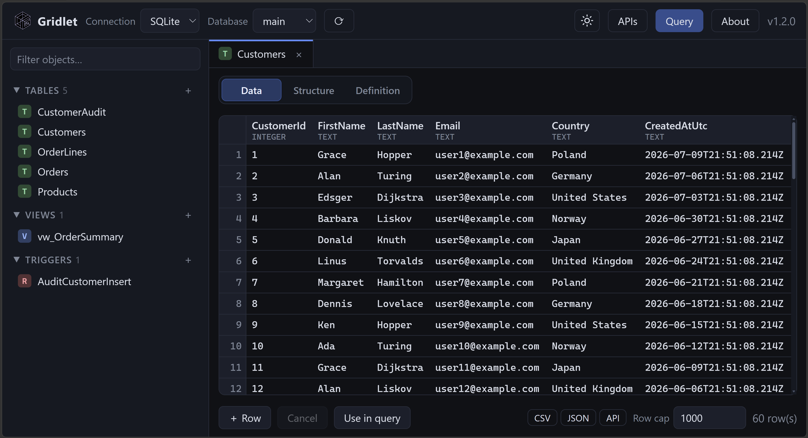
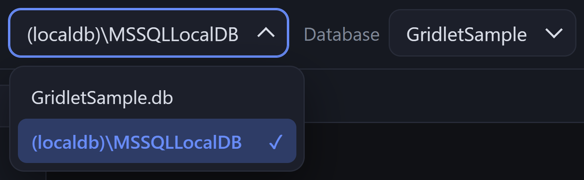
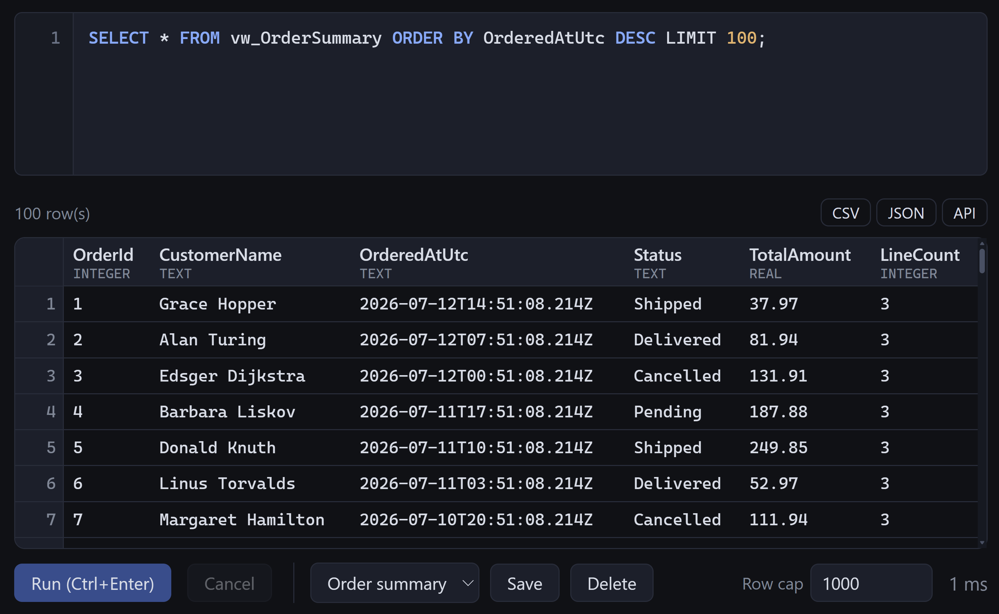
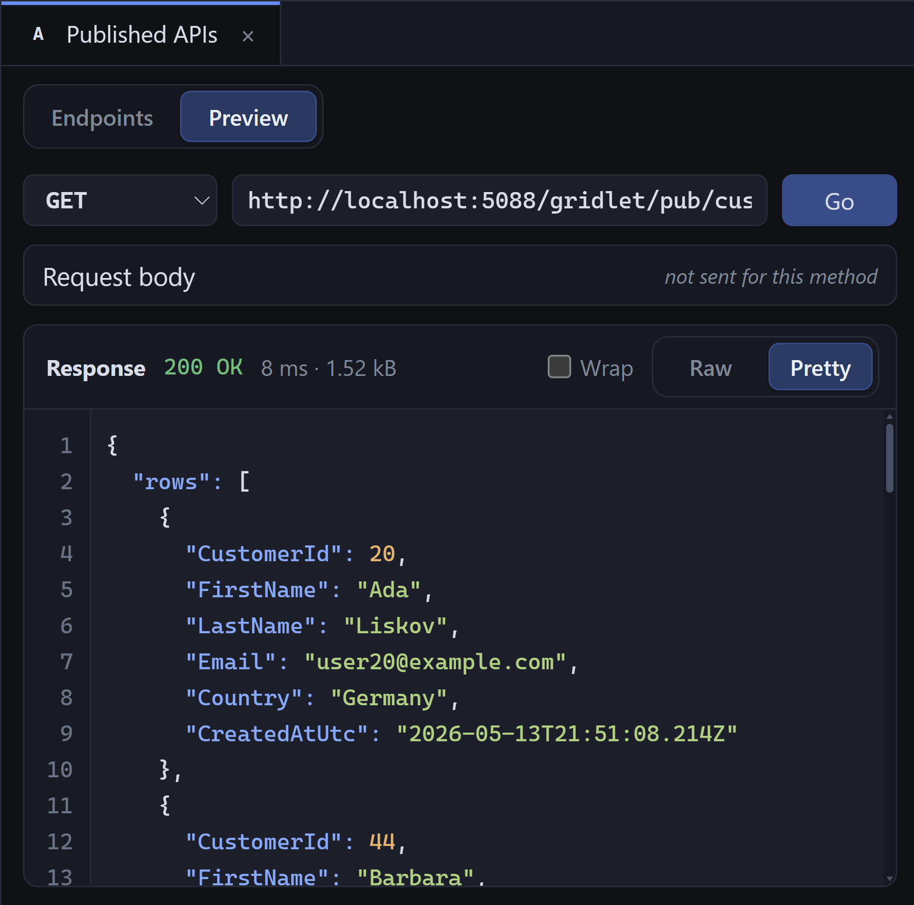

<p align="center">
  
</p>

<h1 align="center">Gridlet</h1>

Gridlet is an embeddable ASP.NET Core NuGet package that adds a configurable, web-based database
management interface to an existing application: browse schema, view and stream through data, inspect
keys/indexes/relationships, and run queries, all from inside the host app using the host's own
authentication, authorization, routing, logging, and deployment model.

<p align="center">
  
</p>

## Multiple providers

Register SQL Server and SQLite connections side by side, then switch between providers and their
databases from the Gridlet header. Gridlet adapts its object browser and tools to the selected
provider, surfacing the database objects and operations it supports, such as stored procedures and
functions in SQL Server, while omitting concepts that do not apply to that provider.

```csharp
.AddSqlServer(sqlServerConnectionString)
.AddSqlite(sqliteConnectionString);
```

<p align="center">
  
</p>

## Query editor

Write and run SQL inside Gridlet, inspect results as they stream in, save useful queries, and export
the current result set as CSV or JSON.

<p align="center">
  
</p>

## Talk with your database

The optional `Gridlet.AgentFramework` package adds an **Ask** workspace powered by
[Microsoft Agent Framework](https://learn.microsoft.com/en-us/agent-framework/). It keeps two
capability sets separate:

- **Data** mode can inspect schema and run one bounded, read-only query at a time. It has no write
  or DDL tool.
- **Design / Schema** mode can inspect objects, columns, indexes, relationships, and definitions.
  It can propose DDL in its answer, but it cannot apply it.

Profiles can use a ChatGPT subscription through the local Codex runtime, a GitHub Copilot
subscription through the local Copilot CLI, the OpenAI API, Anthropic Claude, an OpenAI-compatible
endpoint, or local Ollama. Provider URLs and models are allow-listed by the host. An API server key
may come from configuration, User Secrets, or a vault; alternatively, authenticated users can enter
their own key. User keys are held only in server memory behind an expiring, user-bound handle and
are never written to Gridlet storage or browser storage.

```csharp
builder.Services
    .AddGridlet()
    .AddSqlServer(managementConnectionString, connection =>
    {
        connection.AllowAgentSchemaAccess = true;
        connection.AllowAgentDataAccess = true;
        connection.AgentDataConnectionString = readOnlyConnectionString;
    })
    .AddAgentFramework(agents =>
    {
        // Uses the ChatGPT account owned by the local Codex installation; no API key.
        agents.AddCodex("codex-subscription", "gpt-5.4")
            .WithReasoningEffort(GridletCodexReasoningEffort.High);

        // Uses the account owned by the local GitHub Copilot CLI; no API key.
        agents.AddGitHubCopilot("github-copilot", "gpt-5")
            .WithReasoningEffort(GridletCopilotReasoningEffort.Medium);

        agents.AddOpenAI("openai", "gpt-5-mini")
            .WithServerApiKey(builder.Configuration["AI:OpenAI:ApiKey"])
            .AllowUserApiKeys();

        agents.AddAnthropic("claude", "claude-sonnet-4-5")
            .AllowUserApiKeys();

        agents.AddOllama(
            "local", new Uri("http://127.0.0.1:11434"), "qwen3:4b");
    });
```

`AddCodex` launches `codex app-server` over stdio/JSON-RPC and uses the ChatGPT login stored by that
local Codex installation. Install the Codex CLI and run `codex login` as the same operating-system
user that runs the .NET application. Gridlet never receives the ChatGPT tokens. This is a host-level
identity, not a separate identity for each web user: use it only where application users are meant
to share the host's Codex entitlement, and protect the agent endpoints with authorization policies.
The app-server custom-tool bridge is currently an experimental Codex protocol surface.
Set per-profile reasoning with `WithReasoningEffort`; omit it to retain the Codex/model default.
Supported levels depend on the selected model, and `ExtraHigh` maps to app-server's `xhigh` value.
The expanded Thinking panel shows every reasoning surface app-server supplies without requesting
more than Codex's concise summary: summary sections, optional model-supported raw reasoning, tool
activity, and authoritative completed-item corrections. Raw reasoning is not available from every
model or turn.
For schema-heavy conversations, increase `MaxToolIterations` up to its validated maximum of `100`,
or set it to `null` for no Gridlet-imposed ceiling. Providers can still impose their own limits.
When Gridlet's configured limit is reached, it asks Codex to finish using the information already
collected and streams that tool feedback to the client.

`AddGitHubCopilot` launches the installed GitHub Copilot CLI over stdio using GitHub's Copilot SDK
and Microsoft Agent Framework adapter. Install the CLI and run `copilot login` as the same
operating-system user that runs the .NET application. Gridlet never receives the stored GitHub
credentials. As with Codex, this is a shared host-level identity rather than a separate identity for
each web user. Gridlet disables Copilot configuration discovery and allow-lists only the custom
schema/read-only database tools for the session; Copilot's shell, filesystem, MCP, and other built-in
tools are unavailable. `WithReasoningEffort` supports `Low`, `Medium`, `High`, and `ExtraHigh` when
the selected Copilot model advertises that capability. Gridlet requests Copilot's concise reasoning
summary and shows every reasoning event supplied by the adapter in the expanded Thinking panel.
The optional `MaxToolIterations` ceiling is enforced through a pre-tool hook; when reached, the
denial includes feedback directing the model to finish with the data already collected.

See GitHub's documentation for [local CLI authentication](https://docs.github.com/en/copilot/how-tos/copilot-sdk/setup/local-cli)
and the [Microsoft Agent Framework integration](https://docs.github.com/en/copilot/how-tos/copilot-sdk/integrations/microsoft-agent-framework).

`Gridlet.AgentFramework` is published as a prerelease package because some Microsoft Agent
Framework provider adapters remain preview dependencies.

## Published APIs

Turn a query into an HTTP endpoint, then test it with the built-in request preview and inspect the
status, timing, size, and formatted JSON response. Published endpoints can be protected by
authorization policies already defined by the host ASP.NET Core app.

<p align="center">
  
</p>

## Quick start

In an app that already configures ASP.NET Core authentication and authorization:

```csharp
using Gridlet;

var builder = WebApplication.CreateBuilder(args);

builder.Services
    .AddGridlet()
    .AddSqlServer(builder.Configuration.GetConnectionString("Default"));

var app = builder.Build();

app.MapGridlet();

app.Run();
```

Browse to `/gridlet`. Gridlet uses the host's default authorization policy. Add more connections by
chaining `.AddSqlServer(connectionString)` or `.AddSqlite(connectionString)`.

## Developer configuration reference

`AddGridlet` registers Gridlet and accepts an optional `Action<GridletOptions>`. Chain
`AddSqlServer(...)` or `AddSqlite(...)` once for each connection. Pass a connection string directly,
or pass `IConfiguration` and its key in the standard `ConnectionStrings` section. Each method
registers its provider, derives the connection label from the server or SQLite filename, and selects
the connection string's initial database by default:

```csharp
builder.Services
    .AddGridlet(options =>
    {
        options.Limits.DefaultPageSize = 50;
        options.Limits.MaxPageSize = 500;
        options.Limits.MaxQueryResultRows = 10_000;
        options.Limits.CommandTimeoutSeconds = 30;

        options.Security.AllowAnonymous = false;
        options.Security.AuthorizationPolicy = "GridletAccess";
        options.Security.AgentDataAuthorizationPolicy = "GridletDataAgent";
        options.Security.AgentSchemaAuthorizationPolicy = "GridletSchemaAgent";
        options.Security.AgentCredentialAuthorizationPolicy = "GridletAgentCredentials";

        options.Storage.FilePath = "App_Data/gridlet-store.json";
    })
    .AddSqlServer(builder.Configuration, "Reporting", connection =>
    {
        connection.AllowSqlExecution = true;
        connection.AllowWrites = false;
        connection.AllowDdl = false;
        connection.AllowAgentSchemaAccess = true;
        connection.AllowAgentDataAccess = true;
        connection.AgentDataConnectionString = readOnlyReportingConnectionString;
    });
```

### `GridletOptions`

| Property | Default | Effect |
| --- | --- | --- |
| `Connections` | Empty | Explicit allow-list of connections exposed by Gridlet. Calls to `AddSqlServer(connectionString)` and `AddSqlite(connectionString)` populate it; Gridlet does not automatically expose the host application's other connection strings. |
| `Limits` | New `GridletLimitsOptions` | Server-side paging, result-size, and timeout protections. |
| `Security` | New `GridletSecurityOptions` | Authentication and authorization applied to the entire Gridlet route group. |
| `Storage` | New `GridletStorageOptions` | Persistence settings for saved queries and published endpoint definitions. |

The lower-level, provider-agnostic
`AddConnection(name, connectionString, providerName, configure)` API remains available for custom
registration:

| Argument | Effect |
| --- | --- |
| `name` | Unique, case-insensitive name displayed in the UI and embedded in API routes. |
| `connectionString` | Provider-specific connection string used only on the server; it is never returned to the browser. Use a least-privileged database identity. |
| `providerName` | Required `GridletProviderNames` enum value selecting the provider implementation. Chain `.AddSqlServer()` or `.AddSqlite()` to register the selected provider. |
| `configure` | Optional callback for the connection feature gates described below. |

`AddConnection(configuration, connectionName, providerName, configure)` resolves a value from the
standard `ConnectionStrings` configuration section. Provider-specific registration is simpler for
the built-in SQL Server and SQLite providers because it does not require a name or provider enum.

### Per-connection options

| Property | Default | Effect |
| --- | --- | --- |
| `Name` | Empty | Internal display/route label. Provider-specific registration derives it automatically; lower-level `AddConnection` calls must supply a non-empty, unique value. |
| `ConnectionString` | Empty | Secret server-side database connection string. Normally set by `AddConnection` and never exposed by Gridlet APIs. |
| `ProviderName` | `GridletProviderNames.Unspecified` | Strongly typed provider selection. `Unspecified` is rejected during validation, and `AddConnection` requires a concrete value explicitly. |
| `DefaultDatabase` | `null` | Database selected when the UI first opens the connection. Provider-specific registration derives it from the connection string when available. |
| `AllowSqlExecution` | `true` | Shows and enables the ad-hoc SQL editor. This permits any statement allowed by the database login, including writes or DDL; it is independent of the two UI feature gates below. |
| `AllowWrites` | `true` | Enables Gridlet's explicit row insert/update/delete UI and endpoints. It does not prevent write statements submitted through the SQL editor. |
| `AllowDdl` | `true` | Enables Gridlet's schema-changing UI and endpoints: creating, altering, and dropping schemas, tables, columns, keys, indexes, views, routines, and triggers where supported. It does not prevent DDL submitted through the SQL editor. |
| `AllowAgentSchemaAccess` | `false` | Allows Design / Schema chat to send schema metadata and object definitions to a configured model. The agent cannot apply DDL. |
| `AllowAgentDataAccess` | `false` | Allows Data chat to inspect schema and run bounded read-only queries. |
| `AgentDataConnectionString` | `null` | Separate server-side connection string for the Data agent. Use a SELECT-only identity. Never returned by Gridlet. |
| `AllowAgentDataWithPrimaryConnection` | `false` | Explicitly opts into using the primary Gridlet identity when no agent-specific connection is configured. Avoid this when the primary identity can write or run DDL. |

### Limit options

| Property | Default | Effect |
| --- | --- | --- |
| `DefaultPageSize` | `50` | Default size for the paged table-data API retained for API consumers. The interactive UI uses streaming. Must be at least 1. |
| `MaxPageSize` | `500` | Server-enforced upper bound for paged browse requests and the batch size used by streamed table/view browsing. Must be at least `DefaultPageSize`. |
| `MaxQueryResultRows` | `10,000` | Maximum rows retained per query result set or streamed table/view for the interactive UI and ad-hoc query editor. This is a hard cap there: the **Row cap** control can request a lower value (persisted per browser) but can never exceed it. It does **not** apply to published API endpoints, which are uncapped by default and set any cap per endpoint (see [API publishing](#api-publishing)). Results stream progressively and virtualize above 1,000 rows; the cap still protects server and browser memory. |
| `CommandTimeoutSeconds` | `30` | Provider command timeout for query execution. The user can cancel sooner with the query toolbar's Cancel button. Must be at least 1. |

### Security options

| Property | Default | Effect |
| --- | --- | --- |
| `AllowAnonymous` | `false` | When false, `MapGridlet` applies ASP.NET Core authorization to every UI, API, asset, and published endpoint under the mount path. Set true only when anonymous database tooling is intentional, typically local development. A named `AuthorizationPolicy` takes precedence. |
| `AuthorizationPolicy` | `null` | Named ASP.NET Core authorization policy applied to the Gridlet route group. When null, the host's default policy is used unless `AllowAnonymous` is true. The policy must be registered by the host. When set, it always applies. |
| `AgentDataAuthorizationPolicy` | `null` | Optional additional policy for Data chat. |
| `AgentSchemaAuthorizationPolicy` | `null` | Optional additional policy for Design / Schema chat. |
| `AgentCredentialAuthorizationPolicy` | `null` | Optional additional policy for creating and removing ephemeral user-key handles. |
| `AllowAnonymousAgentCredentials` | `false` | Allows anonymous BYOK handles only when explicitly enabled. Authenticated, user-bound keys are the default. |

### Agent Framework options

`AddAgentFramework` is optional and lives in the `Gridlet.AgentFramework` package. It accepts named,
host-controlled profiles through `AddCodex`, `AddGitHubCopilot`, `AddOpenAI`, `AddAnthropic`,
`AddOpenAICompatible`, and `AddOllama`. API-backed profile builders support `WithServerApiKey` and
`AllowUserApiKeys`; subscription-backed Codex and GitHub Copilot profiles reject both because
authentication belongs exclusively to the local CLI runtime. `AsLocal` controls the safe locality
metadata exposed for OpenAI-compatible profiles.

| Property | Default | Effect |
| --- | --- | --- |
| `CredentialLifetime` | 30 minutes | Lifetime of an ephemeral user-key handle; constrained to at most one day. |
| `MaxHistoryMessages` / `MaxHistoryCharacters` | `50` / `200,000` | Per-turn conversation-history limits. Conversations remain browser-held and are not persisted. |
| `MaxMessageCharacters` | `20,000` | Maximum current user message length. |
| `MaxToolResultCharacters` | `32,000` | Maximum serialized schema or query result sent back to a model tool call. |
| `MaxQueryCharacters` / `MaxQueryRows` | `20,000` / `100` | Data-agent SQL and per-result-set row caps. |
| `QueryTimeoutSeconds` | `120` | Timeout for the data agent's read-only query tool. |
| `MaxToolIterations` / `MaxOutputTokens` | `8` / `4,096` | Optional tool-call limit (`null` disables Gridlet's ceiling) and API-model output-token request. Subscription-backed CLI providers do not expose an equivalent stable output-token field. |
| `CodexExecutablePath` | `codex` | Command or absolute path used to launch `codex app-server` for subscription-backed profiles. |
| `CopilotExecutablePath` | `copilot` | Command or absolute path used to launch GitHub Copilot CLI for subscription-backed profiles. |

Authentication itself remains the host application's responsibility. Configure ASP.NET Core
authentication and authorization before mapping Gridlet; Gridlet does not provide a separate login.

### Storage options

| Property | Default | Effect |
| --- | --- | --- |
| `FilePath` | `gridlet-store.json` | JSON file for saved queries and published endpoint definitions. Relative paths resolve from the host content root, and the process needs read/write access to the containing directory. It does not contain result data or connection strings. |

Replace `ISavedQueryStore` and/or `IPublishedEndpointStore` after `AddGridlet` to use a database or
another persistence mechanism. Gridlet uses `TryAdd`, so explicit host registrations take precedence.

### Mapping and operational services

`app.MapGridlet(pattern)` maps the UI and its APIs under `pattern`, which defaults to `/gridlet`.
The pattern may be changed, for example `app.MapGridlet("/internal/database")`. Configuration is
validated when the endpoints are mapped, so invalid connection names or limit combinations fail at
startup rather than on the first request.

Query execution, row writes, schema changes, and published endpoint invocations are sent to
`IGridletAuditSink`. The default sink writes structured events through `ILogger`; register your own
`IGridletAuditSink` before or after `AddGridlet` to persist them elsewhere (`TryAdd` preserves it).

## Packages

| Package | Purpose |
| --- | --- |
| `Gridlet.Core` | Provider-agnostic abstractions, domain model, options, auditing. |
| `Gridlet.AspNetCore` | `AddGridlet()` / `MapGridlet()`, JSON API, embedded web UI. |
| `Gridlet.AgentFramework` | Optional Microsoft Agent Framework integration with subscription-backed Codex, OpenAI, Anthropic, OpenAI-compatible, and Ollama profiles. |
| `Gridlet.SqlServer` | SQL Server provider (schema, data paging, query execution). |
| `Gridlet.Sqlite` | SQLite provider (schema, data paging, query execution, writes, and DDL). |

The provider boundary (`IGridletProvider` → `ISchemaReader`, `ITableDataService`, `IQueryRunner`)
keeps the core and UI engine-neutral so providers such as `Gridlet.Postgres` and `Gridlet.MySql`
can be added later without rewriting the product.

## Repository layout

```
src/
  Gridlet.Core/          core abstractions + domain model
  Gridlet.AgentFramework/ optional Microsoft Agent Framework integration
  Gridlet.AspNetCore/    host integration, API endpoints, embedded UI
  Gridlet.SqlServer/     SQL Server provider
  Gridlet.Sqlite/        SQLite provider
tests/
  Gridlet.Tests/         unit tests + in-memory endpoint/auth tests (no DB required)
  Gridlet.BrowserTests/  end-to-end browser tests for the embedded UI
  Gridlet.ConsumerCompileTest/  compile-time checks for the public consumer API
samples/
  Gridlet.Demo/          runnable demo against a local SQLite file
```

## Demo

`samples/Gridlet.Demo` is the runnable sample project. It creates and seeds a local
`GridletSample.db` SQLite database on first run (customers/products/orders plus a view and an audit
trigger), and mounts
Gridlet at `/gridlet` with anonymous access.
It also registers an `OddSecond` ASP.NET Core authorization policy and includes a published endpoint
definition in the sample `gridlet-store.json` for `GET /gridlet/pub/samples/odd-second`. The endpoint
returns query results during odd-numbered UTC
seconds and returns `403 Forbidden` during even-numbered UTC seconds, demonstrating how a published
endpoint can require a host-defined policy while the rest of the sample remains anonymous.

```
dotnet run --project samples/Gridlet.Demo
# → http://localhost:5088/gridlet
# retry this URL on consecutive seconds to see alternating 200/403 responses:
# → http://localhost:5088/gridlet/pub/samples/odd-second
```

## Security model

- **AuthN/AuthZ:** Gridlet maps all endpoints inside one route group and applies
  `RequireAuthorization()` (or the policy named in `Security.AuthorizationPolicy`). It never invents
  its own login; it reuses whatever the host has configured.
- **Identifiers:** every schema/table/column name that reaches dynamic SQL is validated against
  live metadata and bracket-quoted; values always travel as parameters.
- **Limits:** page size, query row caps, and command timeouts are enforced from `GridletOptions.Limits`.
- **SQL editor:** can be disabled per connection (`AllowSqlExecution = false`). Statement-level
  write protection is intentionally delegated to the SQL login's own permissions: point Gridlet at
  a login that has exactly the rights its users should have.
- **Feature gates:** row editing (`AllowWrites`) and the table designer (`AllowDdl`) can each be
  switched off per connection; the UI hides the controls and the endpoints return 403.
- **Designer safety:** designer data types are validated against a whitelist, every identifier is
  bracket-quoted, and row values always travel as SQL parameters.
- **Audit:** queries, row writes, schema changes, and published-API invocations flow through
  `IGridletAuditSink` (default: structured logging); replace the sink to persist audit events.
- **Agents:** both modes are default-off per connection. Data mode has only a guarded read-query
  tool and should use `AgentDataConnectionString` with a SELECT-only database principal. Design mode
  never receives a query or mutation tool. Tool results, schema definitions, and cell values are
  treated as untrusted model input; row, character, iteration, token, and timeout caps are enforced.
- **Agent keys:** server keys remain in host configuration. User keys require authentication by
  default, live only in process memory, are zeroed when removed/expired, and are referenced by
  opaque handles sent in request bodies rather than URLs.

An explicitly configured `AuthorizationPolicy` takes precedence over `AllowAnonymous`. This makes a
named policy fail closed even if a development configuration layer also sets `AllowAnonymous` to
`true`. Anonymous access is enabled only when `AllowAnonymous` is `true` and no named policy is set.

### Separate database identity for published APIs

You can configure a second named connection for published endpoints so their SQL runs as a
least-privileged database user:

```csharp
options.AddConnection("Management", adminConnectionString, GridletProviderNames.SqlServer);

options.AddConnection(
    "PublishedApi",
    restrictedApiConnectionString,
    GridletProviderNames.SqlServer,
    configure: connection =>
{
    // Hide interactive mutation tools for this connection. These are Gridlet feature gates;
    // the restricted database user's GRANT/DENY permissions remain the security boundary.
    connection.AllowSqlExecution = false;
    connection.AllowWrites = false;
    connection.AllowDdl = false;
});
```

Select `PublishedApi` as the connection when publishing the endpoint. Gridlet stores that connection
name with the endpoint and uses its connection string on invocation. This separation is currently
selectable rather than mandatory: a publisher can still select `Management`, so the host must limit
publishing to trusted administrators and review stored endpoint definitions. Gridlet does not yet
have a dedicated execution connection that automatically overrides every published endpoint.

## API publishing

Any query can be published as an HTTP endpoint from the query editor (`Publish…`), or via
`POST {mount}/api/published`. Published endpoints:

- live at `{mount}/pub/{route}` (GET with query-string parameters, or POST, PUT, PATCH, and DELETE with a JSON body),
- bind `@parameters` in the SQL to request values (missing optional parameters become `NULL`),
- let the publisher declare each value parameter as `auto`, `string`, `integer`, `number`, or
  `boolean`; Gridlet performs no implicit filtering, ordering, or pagination,
- inherit Gridlet's authorization and can additionally require a named policy,
- are stored (together with saved queries) in a JSON file at `options.Storage.FilePath`,
  default `gridlet-store.json` under the content root; swap `ISavedQueryStore` /
  `IPublishedEndpointStore` to persist elsewhere.

### Response shape

Invocations **stream** their first result set as JSON, so server memory stays bounded no matter how
large the result is (only one batch of rows is held at a time). The response body is:

```json
{ "rows": [ { "col": "value" }, ... ], "rowCount": 123 }
```

`rows` streams first; `rowCount` is only known once every row has been sent, so it **trails** the
array. A statement with no result set returns `{ "recordsAffected": N }` instead. There is no
`truncated` field: published endpoints are uncapped by default (see below), so there is normally
nothing to truncate.

Because the `200 OK` status and the first rows are already on the wire, a failure that occurs
**after** streaming has begun cannot change the status code. Such a failure closes the JSON with an
`"error"` field (`{ "rows": [ ... ], "rowCount": N, "error": "message" }`), which consumers should
check for before trusting a partial result. Failures that occur **before** the first byte (routing,
authorization, parameter binding, connection resolution, or an immediate query error) still return a
clean `4xx`/`5xx` status with `{ "error": "message" }`. The `api.invoke` audit event is written when
the stream finishes, so a mid-stream failure is recorded as `succeeded: false`.

### Row cap

Published endpoints are **uncapped by default**. They stream every row, independent of the global
`MaxQueryResultRows` limit (which continues to govern the UI and ad-hoc query editor). An endpoint can
opt into a cap via the optional `maxRows` field on `POST {mount}/api/published`:

- omitted / `null`: uncapped (stream every row),
- `0` or less: uncapped,
- a positive number: cap at that many rows.

Because the default is uncapped, pagination is deliberately query-authored. For example, publish
`page` and `page_size` as
required integer parameters and use them directly in SQL Server:

```sql
SELECT *
FROM dbo.Customers
ORDER BY CustomerId
OFFSET ((@page - 1) * @page_size) ROWS
FETCH NEXT @page_size ROWS ONLY;
```

## Feature status

- [x] Explicitly configured SQL Server connections
- [x] Browse databases, tables, views, stored procedures, functions
- [x] Streaming, sortable data grid for tables and views
- [x] Inspect columns, keys, indexes, constraints, relationships
- [x] View source of views/procedures/functions
- [x] Ad-hoc query editor with multiple result sets, messages, timing
- [x] Safety limits, query timeouts, audit logging
- [x] Configurable mount path, host auth reuse
- [x] Create tables visually; add/edit/remove columns (drop table/column included)
- [x] Edit table rows where permitted (insert/update/delete with NULL support)
- [x] Saved queries
- [x] Export results and table data (CSV/JSON)
- [x] Publish queries/operations as protected API endpoints
- [x] Resizable grid columns (data grids and query results)
- [x] Create/edit views, stored procedures, and functions from the UI
- [x] Discover, create, edit, and delete database triggers
- [x] Create/edit indexes and primary/foreign keys
- [ ] Server-side full-table export (current export covers the loaded rows)

## Provider status

- [x] SQL Server support through the `Gridlet.SqlServer` provider
- [x] SQLite support through the `Gridlet.Sqlite` provider, with provider-specific schema,
  query, write, trigger, and DDL coverage

SQLite exposes its primary database and schema as `main`. It supports tables, views, indexes,
foreign keys, generated columns, row editing, and table-designer DDL; stored procedures, functions,
and user-created schemas are not SQLite features and are omitted from the UI.

## Development

```
dotnet build
pwsh tests/Gridlet.BrowserTests/bin/Debug/net10.0/playwright.ps1 install chromium # first run only
dotnet test
```

Tests run against an in-memory fake provider, temporary SQLite databases, and the real endpoint
pipeline. No SQL Server is needed, so they also run in CI (`.github/workflows/ci.yml`). Browser tests start Gridlet on an ephemeral
loopback port and use headless Chromium; install its pinned Playwright browser once after cloning or
after updating the Playwright package.

## Third-party software

Gridlet's browser UI is implemented in plain HTML, CSS, and JavaScript; it does not bundle a
third-party front-end framework, editor, icon set, or web font.

The distributable packages use the following third-party projects at runtime:

| Dependency | Used by |
| --- | --- |
| [`Microsoft.Data.SqlClient`](https://github.com/dotnet/SqlClient) | SQL Server connectivity |
| [`Microsoft.Data.Sqlite`](https://learn.microsoft.com/dotnet/standard/data/sqlite/) | SQLite ADO.NET connectivity (MIT). |
| [`SQLitePCLRaw`](https://github.com/ericsink/SQLitePCL.raw) and SQLite | Patched native SQLite bundle used by `Gridlet.Sqlite` (Apache-2.0 / public domain). |
| [`Microsoft.Extensions.DependencyInjection.Abstractions`](https://github.com/dotnet/runtime), [`Microsoft.Extensions.Logging.Abstractions`](https://github.com/dotnet/runtime), and [`Microsoft.Extensions.Options`](https://github.com/dotnet/runtime) | Core hosting abstractions |
| [`Microsoft.Extensions.FileProviders.Embedded`](https://github.com/dotnet/aspnetcore) and the ASP.NET Core shared framework | Embedded UI and ASP.NET Core integration |

The test project additionally uses [xUnit.net](https://github.com/xunit/xunit) and its Visual Studio
runner under the Apache License 2.0, plus Microsoft's MIT-licensed ASP.NET Core TestHost and .NET test
SDK. These development dependencies are not bundled into Gridlet's distributable packages.

Copyrights remain with their respective owners. The in-app **About → Licences** tab provides the
runtime notices to Gridlet users; complete license texts and notices are available from the linked
projects.
