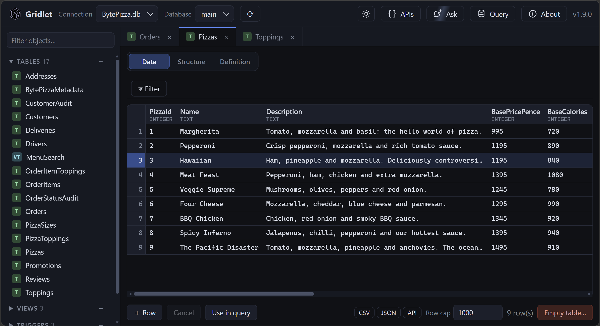
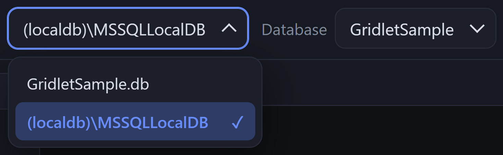
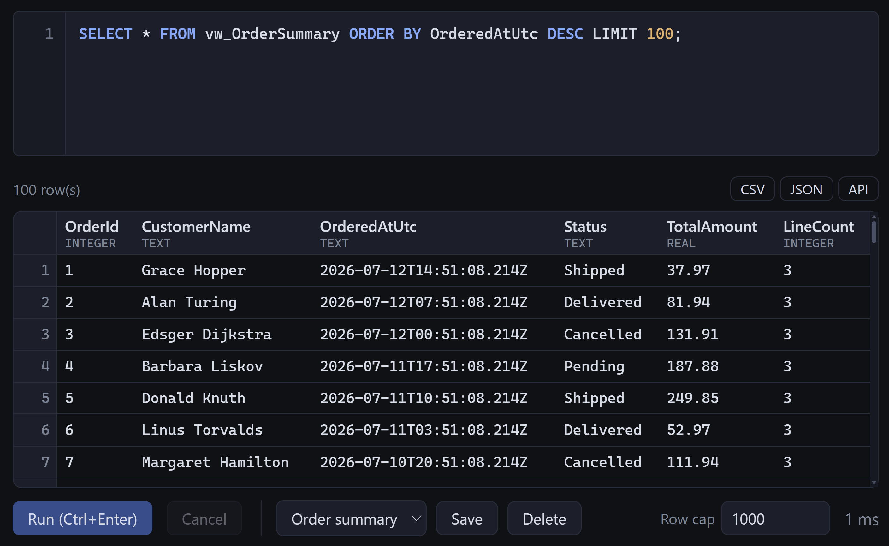
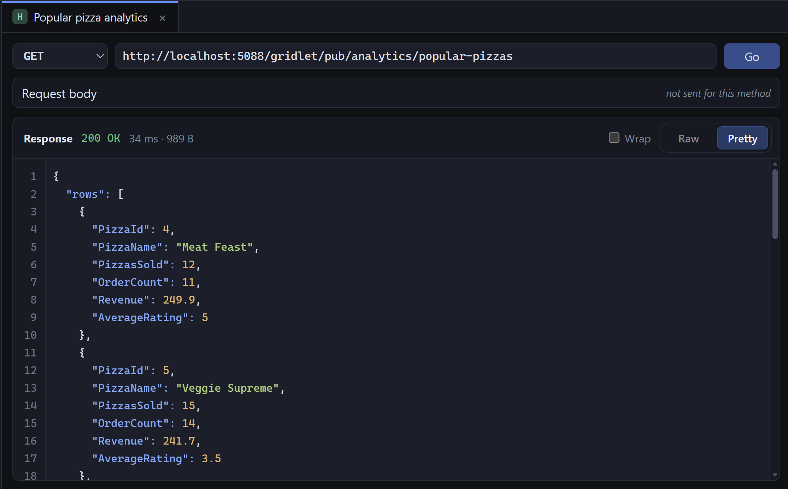

<p align="center">
  
</p>

<h1 align="center">Gridlet</h1>

Gridlet is an embeddable ASP.NET Core database management interface. Add it to an existing
application to browse schemas and data, inspect keys, indexes and relationships, edit database
objects, run queries, publish APIs, and talk to your data with an integrated AI agent, all through
the host application's authentication, authorisation, routing, logging and deployment model.

<p align="center">
  
</p>

## Highlights

- Embed a complete database workspace at `/gridlet` or a custom route.
- Connect SQL Server and SQLite databases side by side.
- Browse tables, views, keys, indexes, relationships, routines and triggers where supported.
- Query, save and export data; optionally enable row editing and schema design.
- Publish queries as protected HTTP endpoints with typed parameters.
- Add natural-language database exploration through the optional AI package.
- Reuse the host application's ASP.NET Core security and operational infrastructure.

## Multiple databases, one interface

Register one or more SQL Server and SQLite connections, then switch between them from the Gridlet
header. The interface adapts to the capabilities of the selected provider.

```csharp
builder.Services
    .AddGridlet()
    .AddSqlServer(sqlServerConnectionString)
    .AddSqlite(sqliteConnectionString);
```

<p align="center">
  
</p>

## Query, edit and design

Run SQL with streamed results, save useful queries, and export CSV or JSON. Per-connection feature
gates can enable or hide row editing, ad-hoc SQL and schema-changing tools, while the database
identity remains the final permission boundary.

A query tab can also pin its connection as a session, so an explicit transaction spans several
executions: begin, run the change, look at the result, then commit or roll back. The toolbar shows
whether a transaction is open, and closing the session or the tab rolls it back.

<p align="center">
  
</p>

## Talk with your database

The optional prerelease `Gridlet.AgentFramework` package adds an **Ask** workspace powered by
[Microsoft Agent Framework](https://learn.microsoft.com/en-us/agent-framework/). It can explain
schema, generate SQL, run bounded read-only queries, and work with published GET endpoints.

Schema, data and published-API access are shared independently for each conversation. The host sets
the maximum allowed access, the user chooses what to share, and the agent can request missing access
through an auditable **Allow / Deny** prompt. Gridlet never gives the agent write or DDL tools.

Profiles can use local Codex, Claude Code or GitHub Copilot subscriptions, hosted OpenAI or
Anthropic APIs, OpenAI-compatible endpoints, or Ollama.

<video src="https://github.com/user-attachments/assets/f62b6df5-9681-4a37-b133-3141b31f568d" controls></video>

<p align="center"><em>Gridlet Ask workspace demonstration.</em></p>

## Publish queries as APIs

Publish a query as a GET, POST, PUT, PATCH or DELETE endpoint, declare typed parameters, attach an
existing ASP.NET Core authorization policy, and test it in the built-in request preview. Endpoints
are served under `/gridlet/pub` by default and can stream JSON or NDJSON responses.

<p align="center">
  
</p>

## Quick start

Gridlet currently targets .NET 10. Install the ASP.NET Core package and a database provider:

```shell
dotnet add package Gridlet.AspNetCore
dotnet add package Gridlet.SqlServer
```

Register a connection and map Gridlet:

```csharp
using Gridlet;

var builder = WebApplication.CreateBuilder(args);

builder.Services
    .AddGridlet()
    .AddSqlServer(builder.Configuration.GetConnectionString("Default")!);

var app = builder.Build();

app.MapGridlet();

app.Run();
```

Open `/gridlet`. By default, every Gridlet endpoint uses the host application's default
authorization policy. The mount path can be changed with `app.MapGridlet("/internal/database")`.

For SQLite, install `Gridlet.Sqlite` and replace `AddSqlServer` with `AddSqlite`.

## Essential configuration

Configure security and connection capabilities when registering Gridlet:

```csharp
builder.Services
    .AddGridlet(options =>
    {
        options.Security.AuthorizationPolicy = "DatabaseAdministrators";
        options.Limits.MaxQueryResultRows = 10_000;
        options.PublishedApiRoutePrefix = "pub";
    })
    .AddSqlServer(connectionString, connection =>
    {
        connection.AllowSqlExecution = true;
        connection.AllowWrites = false;
        connection.AllowDdl = false;

        connection.AllowAgentSchemaAccess = true;
        connection.AllowAgentDataAccess = true;
        connection.AllowAgentApiAccess = true;
        connection.AgentDataConnectionString = readOnlyConnectionString;
    });
```

`AllowSqlExecution`, `AllowWrites` and `AllowDdl` control separate UI and API capabilities. Use a
least-privileged database identity because SQL submitted through the query editor has the
permissions of its configured connection.

Options can also be bound with `AddGridletFromConfiguration`. Hosts that do not need the embedded
UI can map `MapGridletApi` or `MapGridletPublished` instead.

## Security

- Gridlet requires the host's default authorization policy unless a named policy or explicit
  anonymous access is configured.
- Connections are an explicit allow-list; Gridlet does not expose other application connection
  strings automatically.
- Dynamic identifiers are checked against database metadata and values are parameterised.
- Paging, result-size and command-timeout limits are enforced server-side.
- Query execution, writes, DDL and published-API calls produce structured audit events.
- Agent data access can use a separate read-only connection and is always limited to bounded,
  read-only tools.

## Packages

| Package | Purpose |
| --- | --- |
| [`Gridlet.AspNetCore`](https://www.nuget.org/packages/Gridlet.AspNetCore) | ASP.NET Core registration, endpoints and embedded web interface. |
| [`Gridlet.SqlServer`](https://www.nuget.org/packages/Gridlet.SqlServer) | SQL Server provider. |
| [`Gridlet.Sqlite`](https://www.nuget.org/packages/Gridlet.Sqlite) | SQLite provider. |
| [`Gridlet.AgentFramework`](https://www.nuget.org/packages/Gridlet.AgentFramework) | Optional prerelease AI integration. |
| [`Gridlet.Core`](https://www.nuget.org/packages/Gridlet.Core) | Provider abstractions, models, options and auditing. |

## Provider support

| Provider | Coverage |
| --- | --- |
| SQL Server | Databases, schemas, tables, views, keys, indexes, relationships, procedures, functions, triggers, queries, writes and DDL. |
| SQLite | The `main` database, tables, views, keys, indexes, relationships, generated columns, triggers, queries, writes and DDL. |

Provider-specific concepts are omitted when they do not apply; for example, SQLite does not expose
stored procedures, functions or user-created schemas.

## Demo

The sample application creates a seeded SQLite database and, on Windows when available, a SQL
Server LocalDB database:

```shell
dotnet run --project samples/Gridlet.Demo
```

Open [http://localhost:5088/gridlet](http://localhost:5088/gridlet).

## Development

```shell
dotnet build
dotnet test --configuration Release
```

The test suite covers the core services, real endpoint pipeline, temporary SQLite databases and the
embedded interface through headless Chromium. SQL Server is not required for the tests.
